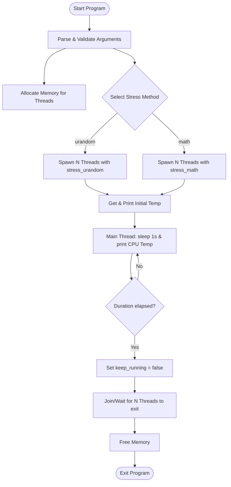
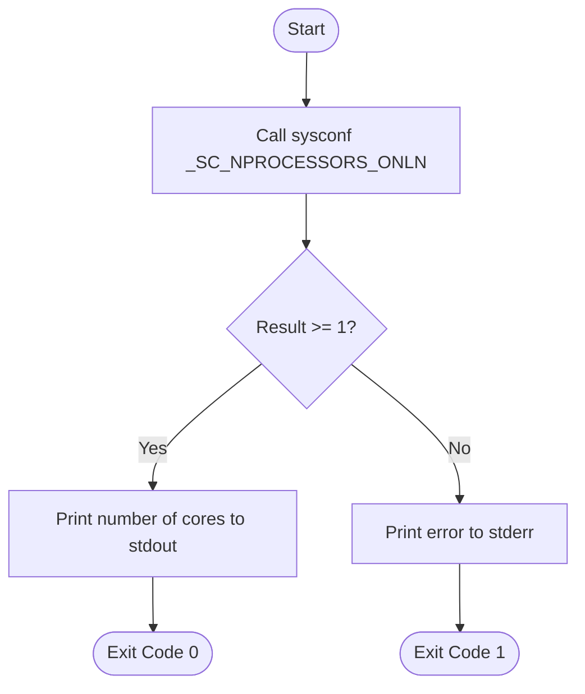

# CPU Stress CLI Tool Specification

---

## Table of Contents

1. [Overview](#1-overview)
2. [Command Usage](#2-command-usage)
3. [Detailed Stress Modes](#3-detailed-stress-modes)
4. [Design Specification of the C Code](#4-design-specification-of-the-c-code)
5. [Performance Profiles Compared](#5-performance-profiles-compared)
6. [CPU Core Detection Utility (`cpu_cores`)](#6-cpu-core-detection-utility-cpu_cores)
7. [CPU Temperature Monitoring Module (`cpu_temp`)](#7-cpu-temperature-monitoring-module-cpu_temp)
8. [CPU Identifier Module (`cpu_id`)](#8-cpu-identifier-module-cpu_id)
9. [Timestamp Generation Module (`timestamp`)](#9-timestamp-generation-module-timestamp)
10. [CSV Temperature Logging in `cpu_stress`](#10-csv-temperature-logging-in-cpu_stress)
11. [Temperature Plot Utility (`plot_temp`)](#11-temperature-plot-utility-plot_temp)
12. [Temperature Inventory Utility (`list_temps`)](#12-temperature-inventory-utility-list_temps)
13. [Current Status / Next Steps](#13-current-status--next-steps)
14. [Sensor Configuration File (`cpu_temp.conf`)](#14-sensor-configuration-file-cpu_tempconf)
15. [Known Limitations & Portability Notes](#15-known-limitations--portability-notes)
16. [Future Directions: Other CPU Stress Approaches](#16-future-directions-other-cpu-stress-approaches)
17. [Security Audit (`security_audit.sh`)](#17-security-audit-security_auditsh)

---

This document details the design, usage, and internal architecture of the `cpu_stress` utility.

---

## 1. Overview

The `cpu_stress` utility is a command-line program written in C designed to simulate high CPU utilization across a user-specified number of CPU cores for a designated duration while monitoring CPU temperature in real-time. It is built to demonstrate the difference between kernel-space CPU stress (via system calls) and user-space CPU stress (via raw calculations).

The project also includes supporting utilities for core counting, CPU identification, timestamp generation, CPU-temperature probing, plotting CSV logs, and listing all temperature sensors exposed by the system.

### Utility Overview

| Utility | Purpose | Typical Use |
| :--- | :--- | :--- |
| `cpu_stress` | Run a timed CPU stress workload and log temperature to CSV | `./cpu_stress auto 60 math` |
| `cpu_cores` | Print the number of online CPU cores | `./cpu_cores` |
| `cpu_temp` | Read the selected CPU temperature sensor once or repeatedly | `./cpu_temp`, `./cpu_temp 2`, `./cpu_temp --verbose` |
| `cpu_id` | Print a sanitized CPU identifier suitable for filenames | `./cpu_id` |
| `timestamp` | Print a filename-safe timestamp | `./timestamp` |
| `plot_temp` | Plot one or more CSV logs into a PNG chart | `./plot_temp results/` |
| `list_temps` | Inventory all readable thermal/hwmon temperatures on the system | `./list_temps`, `./list_temps --details` |

### Building the Project

The utilities are plain C and depend only on the C standard library, POSIX
headers and **pthread** — there are no external build-time libraries. Build
everything with:

```bash
make            # builds all utilities
make check      # build + smoke-test every binary (exit-code check)
make install    # install to ~/.local/bin (override: make install PREFIX=/usr/local)
make uninstall  # remove installed binaries
make plot       # re-generate PNG plot from all CSVs in results/ (needs gnuplot)
make clean      # removes binaries and object files
```

**Prerequisites**

| Requirement | Debian/Ubuntu package | Arch/Manjaro package | Fedora/openSUSE (RPM) package | Needed for |
| :--- | :--- | :--- | :--- | :--- |
| C compiler | `gcc` | `gcc` | `gcc` | building (required) |
| `make` | `make` | `make` | `make` | building (required) |
| C headers + pthread | `libc6-dev` *(via `build-essential`)* | `glibc` *(+`base-devel`)* | `glibc-devel` *(+ Development Tools)* | building (required) |
| `gnuplot` | `gnuplot` | `gnuplot` | `gnuplot` | running `plot_temp` only (optional) |

Quick install of everything:

```bash
# Debian / Ubuntu
sudo apt install -y build-essential gnuplot
# Arch / Manjaro
sudo pacman -S --needed base-devel gnuplot
# Fedora / RHEL
sudo dnf groupinstall -y 'Development Tools' && sudo dnf install -y gnuplot
# openSUSE
sudo zypper install -t pattern devel_basis && sudo zypper install gnuplot
```

**Checking prerequisites (`check_build_deps.sh`)**

To verify a machine is ready to build and run the tools, use the bundled
checker. It detects the distro family and prints the exact install command for
anything missing on apt-, pacman-, and RPM-based (dnf/zypper) systems, and runs
a compile + pthread-link self-test to confirm the toolchain actually works.
The section matching the detected system is highlighted with a `→` marker:

```bash
./check_build_deps.sh            # report what is present/missing
./check_build_deps.sh --quiet    # only print missing items + install hint
./check_build_deps.sh --build    # also run `make` to confirm a full build
./check_build_deps.sh --install  # offer to install missing packages (asks first)
```

Exit code `0` = all **required** build dependencies present; `1` = something
required is missing. `gnuplot` is optional (only `plot_temp` needs it).

> **Validation note:** the Debian and Arch code paths have been exercised on
> real systems; the RPM (Fedora/openSUSE) paths were validated by simulation
> (a stubbed `/etc/os-release` plus stand-in `dnf`/`zypper`), not yet on real
> Fedora/openSUSE hosts. The package names are the standard ones, but if you hit
> a discrepancy on a real RPM system it is a one-line fix in the script's `DEPS`
> table.

> A companion script, `check_audit_deps.sh`, performs the same kind of check for
> the security-audit tooling — see [§17](#17-security-audit-security_auditsh).

A dated history of notable changes is kept in [`CHANGELOG.md`](CHANGELOG.md).

---

## 2. Command Usage

### Syntax
```bash
./cpu_stress <num_cores> <duration_seconds> [method]
```

### Arguments
*   `num_cores` (integer $>0$, or string/integer `auto`, `all`, `0`): The number of worker threads to spawn. If `auto`, `all`, or `0` is passed, the utility automatically queries the system to stress all available online CPU cores.
*   `duration_seconds` (integer, $>0$): The runtime duration of the stress test in seconds.
*   `method` (string, optional): The stressing strategy to apply:
    *   `urandom` (Default): Uses `/dev/urandom` reads to stress CPU via kernel-space operations.
    *   `math`: Uses a computational busy-loop to stress CPU via user-space operations.

### Examples
```bash
# Stress all available cores for 10 seconds using the default urandom mechanism
./cpu_stress auto 10 urandom

# Stress 8 cores for 30 seconds using the math busy-loop mechanism
./cpu_stress 8 30 math

# Dynamically query and stress all cores using the cpu_cores utility in a subshell
./cpu_stress $(./cpu_cores) 15 math

# Stress 4 cores for 120 seconds, polling temperature every 5 seconds
./cpu_stress 4 120 math 5
```


---

## 3. Detailed Stress Modes

### A. The `/dev/urandom` Mechanism (`urandom`)
*   **Mechanism**: Threads repeatedly issue `read` system calls against the special character device `/dev/urandom` into a $4\,\text{KB}$ local buffer, discarding the data.
*   **CPU Profile**: Heavy **System (Kernel) CPU time** (`sy`).
*   **Behavior**: 
    1. The operating system kernel processes each read request by generating pseudorandom bytes using its cryptographic entropy-based generator.
    2. The data is copied from kernel-space memory to user-space memory (the thread's buffer).
    3. This creates a high frequency of system calls and context transitions, stressing the OS kernel's scheduler, memory subsystem, and random number generator logic.

### B. The Computational Busy-Loop (`math`)
*   **Mechanism**: Threads execute a tight mathematical loop in user space without requesting any kernel assistance.
*   **CPU Profile**: Heavy **User CPU time** (`us`).
*   **Behavior**:
    1. The CPU core runs ALU operations continuously (multiplication, addition) as fast as the pipeline allows.
    2. Since it does not yield control or make system calls, the CPU execution unit is pushed to its thermal/frequency limit entirely in user space.
    3. It avoids memory copying and system call overhead, yielding a cleaner representation of pure core execution stress.

---

## 4. Design Specification of the C Code

### Flowchart / Program Sequence



### Key Implementation Components

#### 1. Thread Management
*   **API**: POSIX Threads (`pthread` library).
*   **Functions**: `pthread_create` for parallel execution, `pthread_join` to clean up and synchronize thread termination before exit.

#### 2. Thread State Coordination
A single global `volatile bool keep_running` flag controls execution. The `volatile` keyword is crucial: it prevents the compiler from caching the flag in a CPU register, ensuring worker threads always read its current value from memory and respond promptly when the main thread sets it to `false`.

#### 3. Core Worker Routines

*   **`stress_urandom`**: Opens `/dev/urandom` and reads in $4\,\text{KB}$ blocks in a tight loop, discarding the data. The 4KB block size balances system call frequency against data throughput.

*   **`stress_math`**: Runs a linear congruential generator (LCG) busy-loop entirely in user space. The accumulator `x` is declared `volatile` to prevent the compiler (`-O2`/`-O3`) from optimizing the loop away when it detects the result is never consumed.

---

## 5. Performance Profiles Compared

| Feature | `urandom` Mode | `math` Mode |
| :--- | :--- | :--- |
| **CPU Time Classification** | Primarily **System / Kernel** (`sy`) | Primarily **User** (`us`) |
| **Primary Stress Target** | Cryptographic engine, sys-call path, kernel scheduler | Arithmetic Logic Units (ALUs), register files, CPU core pipelines |
| **Context Transitions** | High (User-space $\leftrightarrow$ Kernel-space switches) | Zero (Runs strictly in user space) |
| **Interrupt/Scheduler Load** | High | Low (unless context-switched by OS timer interrupts) |
| **Memory Bandwidth** | Moderate (copying bytes from kernel to user buffer) | Extremely Low (register-bound) |

### Visualization in `htop`

The CPU time classification above is directly visible in `htop`'s per-core bar graphs:

*   **`math` mode**: bars appear **entirely green** — all CPU time is user-space (`us`), since the busy-loop never leaves user space and makes no system calls.
*   **`urandom` mode**: bars appear **partially red** — the red portion represents kernel-space time (`sy`) spent processing each `read()` system call (generating random bytes in the kernel and copying them to the user-space buffer). The remaining green portion is user-space overhead (loop control, buffer handling).

| htop color | `/proc/stat` field | Meaning | Which mode |
| :--- | :--- | :--- | :--- |
| Green | `user` | User-space, normal priority (`us`) | Both (100% in `math`) |
| Blue | `nice` | User-space, low priority (`ni`) | Any mode run with `nice`/`renice` |
| Red | `system` | Kernel-space (`sy`) | `urandom` only |
| Orange | `iowait` | Waiting for I/O | I/O-bound workloads |
| Grey/White | `irq`/`softirq` | Hardware/software interrupts | High interrupt rate workloads |

---

## 6. CPU Core Detection Utility (`cpu_cores`)

A small standalone utility is provided to query the number of online CPU cores on the host. This utility can be used in shell scripts to dynamically allocate resources or pass the core count to `cpu_stress`.

### Compilation
You can compile both `cpu_stress` and `cpu_cores` using the provided `Makefile`:
```bash
make
```
Or compile `cpu_cores` individually:
```bash
gcc -O2 -Wall cpu_cores.c -o cpu_cores
```

### Usage
*   **Print online CPU core count**:
    ```bash
    ./cpu_cores
    ```
*   **Print the resolved path/interface source used to determine the core count**:
    ```bash
    ./cpu_cores --show-path
    ```

### Design Specification

#### Architectural Goals
1.  **Lightweight & Minimalist**: The utility is built to execute instantaneously, loading no external dependencies beyond the C standard library.
2.  **Shell Friendly**: Designed to output a single integer to `stdout` with any diagnostic errors written to `stderr`, enabling clean nesting within subshells.

#### Control Flow


#### API Selection Rationale
Several options are available on Linux to determine CPU core count:
*   **Parsing `/proc/cpuinfo`**: Requires opening, reading, and parsing file streams, which is slow and prone to format discrepancies.
*   **`get_nprocs()`**: A glibc-specific function, making it non-portable to non-GNU Unix systems.
*   **`sysconf(_SC_NPROCESSORS_ONLN)`**: A standard POSIX mechanism. It retrieves the CPU cores that are currently online and available to accept threads (taking into account hot-plugging), without file I/O overhead.

Thus, `sysconf(_SC_NPROCESSORS_ONLN)` was chosen to ensure high efficiency, portability, and correctness under dynamic resource scaling.

---

## 7. CPU Temperature Monitoring Module (`cpu_temp`)

The temperature monitoring module is designed to be highly reusable, modular, and portable across Linux environments. It consists of `cpu_temp.h` and `cpu_temp.c`, which compile into a shared object file (`cpu_temp.o`) used by both the standalone `cpu_temp` CLI utility and the `cpu_stress` program.

### Compilation
Build the standalone utility `cpu_temp` (which prints current temperature or monitors it at intervals):
```bash
make cpu_temp
```

### Usage
*   **Print once**:
    ```bash
    ./cpu_temp
    ```
*   **Periodic monitoring (e.g., every 2 seconds)**:
    ```bash
    ./cpu_temp 2
    ```
*   **Print the resolved sensor file path and exit**:
    ```bash
    ./cpu_temp --show-path
    ```
*   **Print all detected CPU-related temperatures and exit**:
    ```bash
    ./cpu_temp --show-all
    ```
    This mode is intentionally **CPU-focused**: it filters output to CPU-relevant thermal zones and hwmon drivers only. It is useful for debugging CPU sensor selection, but it is **not** a full system temperature inventory.
*   **Verbose sensor selection narration**:
    ```bash
    ./cpu_temp --verbose
    ```
*   **Use a config file as fallback when auto-detection fails**:
    ```bash
    ./cpu_temp --config cpu_temp.conf --verbose
    ```
*   **Use config file as primary source, auto-detection as fallback**:
    ```bash
    ./cpu_temp --config cpu_temp.conf --config-primary --verbose
    ```

### Design Specification

#### Architectural Goals
1.  **Modularity**: Decouple the low-level sysfs filesystem access from caller application logic.
2.  **Robust Autodetection**: Scan both `/sys/class/thermal/thermal_zone*` and `/sys/class/hwmon/*` to rank and select the best processor temperature sensor, validating each candidate's reading and falling back to a default zone only if necessary.
3.  **Config-file override**: Allow per-CPU sensor hints in `cpu_temp.conf` to fix auto-detection failures or enable experimentation on exotic hardware.
4.  **Educational verbose mode**: Narrate each step of sensor selection to stdout, making the detection logic observable and learnable.

#### Sensor Detection Priority

The module scans `/sys/class/thermal/thermal_zone*` **and** `/sys/class/hwmon/*`
in a single unified pass, assigning each candidate a rank and selecting the
highest-ranked sensor **whose current reading is plausible**. Higher rank wins:

| Rank | Source | Notes |
| :--- | :--- | :--- |
| 4 | `x86_pkg_temp` thermal zone | Intel package temperature — canonical when present |
| 3 | `k10temp` / `coretemp` hwmon driver | Dedicated AMD / Intel CPU drivers. `k10temp` reports `Tctl`, the die control temperature used by the processor's thermal management unit; `coretemp` reports per-core/package temperatures. |
| 2 | `cpu-thermal` / any type containing `cpu` | ARM / embedded / SoC boards |
| 1 | `acpitz` thermal zone | Generic ACPI zone — often inaccurate or unpopulated |

**Reading validation:** A candidate is only eligible if its reading falls inside
a plausible window (roughly −40°C to 200°C). This rejects sentinel values such as
the −273.20°C (absolute zero) that a disconnected `acpitz` zone commonly reports,
so a broken high-priority sensor never masks a working lower-priority one. For
hwmon drivers the scanner prefers the canonical CPU labels (`Tctl`, `Tdie`,
`Package id 0`) and otherwise uses the first input with a valid reading.

If no ranked candidate produces a valid reading, the module falls back to
**`/sys/class/thermal/thermal_zone0/temp`** as a last resort.

##### Multi-Zone Selection & Tie-Breaking (Behavior under Multiple Zones)

When multiple thermal zones exist on a system (e.g., dual-socket Intel processors, hybrid architectures, or systems with independent socket/motherboard sensor zones), the module relies on a deterministic selection and tie-breaking strategy:

*   **Rank Comparison Across Sources:** The module iterates through every thermal zone *and* every hwmon driver, computes each candidate's rank (and reads its current value), and compares it against the `best_rank` found so far. Thermal zones and hwmon drivers compete in the same ranking, so a dedicated `k10temp`/`coretemp` hwmon driver (rank 3) wins over a generic `acpitz` zone (rank 1).
*   **First-Match-Wins (Strict Inequality):** The check is implemented using strict inequality (`rank > best_rank`) combined with the reading-validity test. If a system has multiple candidates sharing the same highest rank (e.g., multiple `x86_pkg_temp` zones on a multi-socket machine), the first one with a plausible reading encountered in the scan is selected. Any subsequent candidates of the same highest rank are ignored.
*   **Directory Scan Order:** Directory entry traversal is performed using standard POSIX `readdir("/sys/class/thermal")`. This ordering is determined by the filesystem directory indexing structure, meaning it is stable on a given OS boot/filesystem state but arbitrary in general.
*   **Manual Overriding:** If the system-default tie-breaker chooses a less-preferred zone, users can run `./cpu_temp --verbose` to inspect all detected zones, their ranks, and types, then declare a specific preferred sensor driver and label mapping in `cpu_temp.conf`.

#### hwmon Sensor Notes (AMD Ryzen / APU)

On AMD platforms (e.g. Ryzen 5 7430U, Ryzen 5 3500U), the only usable CPU
thermal zone may be absent or broken: the `acpitz` zone often reports the
sentinel −273.20°C. The relevant sensors exposed via hwmon are:

| hwmon driver | Label | Path | Meaning |
| :--- | :--- | :--- | :--- |
| `k10temp` | `Tctl` | `hwmonN/temp1_input` | CPU die control temperature (used for throttling). The correct sensor for CPU stress monitoring. |
| `amdgpu` | `edge` | `hwmon0/temp1_input` | GPU die edge temperature (relevant for GPU workloads, not CPU stress). |
| `mt7921_phy0` | *(none)* | `hwmon2/temp1_input` | Wi-Fi chip temperature — unrelated to CPU. |

`Tctl` may include a small positive offset above the true junction temperature (Tjunction) as a thermal safety margin, which is by design on Zen-based processors.

#### API Selection Rationale
Reading CPU temperatures via sysfs (`/sys/class/thermal` or `/sys/class/hwmon`) provides direct, non-privileged access to kernel-exposed hardware parameters. The sensor path is resolved once per call (no caching), keeping state simple and making verbose narration straightforward.

The public API signature is:
```c
double get_cpu_temperature(const char *config_path, bool config_primary, bool verbose);
```
- `config_path` — path to `cpu_temp.conf`, or `NULL` to skip config entirely.
- `config_primary` — if `true`, consult config before auto-detection; if `false`, use config only as fallback when auto-detection finds nothing.
- `verbose` — if `true`, print detection steps to stdout (used by `cpu_temp` standalone only; `cpu_stress` always passes `false`).

> **Practical distinction:** `./cpu_temp --show-all` lists all **CPU-related** temperatures that the current detection logic considers relevant. The separate `./list_temps` utility lists **all** temperature readings the project can discover under `/sys/class/thermal` and `/sys/class/hwmon`, whether CPU-related or not.

---

## 8. CPU Identifier Module (`cpu_id`)

The `cpu_id` module extracts the host CPU's brand name from `/proc/cpuinfo`, cleans it up for safe inclusion in filenames, and formats it as a slug.

### Compilation
Build the standalone utility `cpu_id`:
```bash
make cpu_id
```

### Usage
Run the binary to output the sanitized CPU identifier:
```bash
./cpu_id
```

Example output on x86:
```
intel_core_i7-8750h_2_20ghz
```

Example output on ARM:
```
arm_cortex-a72
```

### Design Specification

#### Architectural Goals
1.  **Filename Safety**: Remove space characters, brackets, registered trademark indicators, and special symbols.
2.  **Readability**: Lowercase all characters, use single underscores as separators, and strip noise words (e.g., `_r_` or `_tm_`).

#### API Selection Rationale
Reading the `/proc/cpuinfo` file is highly reliable across all Linux distributions and avoids invoking architecture-specific CPUID assembly instructions, preserving portability.

#### ARM Fallback
On ARM processors, the Linux kernel does not populate the `model name` field in `/proc/cpuinfo`. In that case the module falls back to decoding the `CPU implementer` and `CPU part` hex fields:

| Implementer | Part   | Slug                  |
|-------------|--------|-----------------------|
| 0x41 (ARM)  | 0xd03  | `arm_cortex-a53`      |
| 0x41 (ARM)  | 0xd07  | `arm_cortex-a57`      |
| 0x41 (ARM)  | 0xd08  | `arm_cortex-a72`      |
| 0x41 (ARM)  | 0xd09  | `arm_cortex-a73`      |
| 0x41 (ARM)  | 0xd0b  | `arm_cortex-a76`      |
| 0x41 (ARM)  | 0xd0c  | `arm_neoverse-n1`     |
| …           | …      | (see `cpu_id.c`)      |

If the part code is not in the lookup table, the slug falls back to `arm_impl-0x<impl>_part-0x<part>` rather than `unknown_cpu`.

---

## 9. Timestamp Generation Module (`timestamp`)

The `timestamp` module generates the current date and time formatted for filenames using a 24-hour clock.

### Compilation
Build the standalone utility `timestamp`:
```bash
make timestamp
```

### Usage
Run the binary to print the current timestamp:
```bash
./timestamp
```

### Design Specification

#### Architectural Goals
1.  **Uniformity**: Ensure datetime formats remain identical across different locales and systems.
2.  **Safety**: Exclude colon or slash characters which are disallowed in paths and filenames on common operating systems.

#### Format Detail
*   **Format String**: `%Y%m%d_%H%M%S` (yielding `YYYYMMDD_HHMMSS`).
*   **Example Output**: `20260606_183218`.

---

## 10. CSV Temperature Logging in `cpu_stress`

During execution, `cpu_stress` automatically streams the recorded CPU temperatures to a CSV file.

### Filename Format
The CSV log file is saved in the `results/` directory and dynamically named based on the run parameters:
```
results/<cpu_id>_<method>_<num_cores>cores_<duration>sec_<timestamp>.csv
```
Example: `results/intel_n150_math_4cores_3sec_20260606_183218.csv`

### CSV Schema
The file structure starts with a header and logs data at 1-second intervals:
| Column Name | Data Type | Description |
| :--- | :--- | :--- |
| **Timestamp** | String | The YYYYMMDD_HHMMSS timestamp at capture time |
| **ElapsedSeconds** | Integer | Seconds elapsed since starting the stress test |
| **TemperatureCelsius** | Float / String | The CPU temperature in Celsius, or `N/A` if read failed |

#### Sample Log Output
```csv
Timestamp,ElapsedSeconds,TemperatureCelsius
20260606_183218,0,71.00
20260606_183219,1,78.00
20260606_183220,2,79.00
```


---

## 11. Temperature Plot Utility (`plot_temp`)

The `plot_temp` utility reads one or more `cpu_stress` CSV logs and produces a PNG temperature chart via gnuplot.

### Compilation
**Prerequisite**: `gnuplot` must be installed (`sudo apt install gnuplot` / `sudo dnf install gnuplot` / `sudo pacman -S gnuplot`).

```bash
make plot_temp
# or: gcc -O2 -Wall plot_temp.c -o plot_temp
```
Requires `gnuplot` (tested with gnuplot 6.0).

### Usage
```bash
./plot_temp <csv_file|directory> [csv_file ...] [options] [output.png]
```

Inputs can be mixed: individual CSV files, a directory (all `.csv` files inside are loaded), or both. A `.png` argument is treated as the explicit output path.

- If `output.png` is omitted, the output PNG is placed in the **same directory as the input files**. If inputs come from different directories, it defaults to `results/`. The filename is derived from the longest common prefix of all input basenames with the latest timestamp appended.
- The plot title defaults to `"CPU Stress Tests"` for multi-file plots, or the output filename stem for a single file. Override with `--title "custom title"`.
- CPU IDs longer than 15 characters are truncated in series labels. Override with `--truncate N` (only affects style 0).
- **Label Styling**: Select the rendering style of CPU names in the plot legend with `--style N` or `--label-style N`:
  - `--style 0`: The full CPU name, truncated to `N` characters (via `--truncate`).
  - `--style 1` (Default): Generates a highly readable abbreviated format (e.g., `intel_celeron_j4125_cpu_200ghz` → `int cel j4125`, or `amd_ryzen_5_7430u_with_radeon_graphics` → `amd ryz5 7430u`).
  - `--style 2` (Model Only): Extracts and displays only the CPU model number/type ID (e.g., `j4125` or `7430u`).
- **Legend Order**: Control the top-to-bottom order of series in the legend with `--sort MODE`. Series are sorted in descending temperature order so the hottest CPU appears at the top, matching the vertical order of the line endpoints on the right edge of the graph.
  - `--sort last` (Default): Sort by the final temperature value of each series. Best for stress tests that reach a steady-state plateau — the last sample is stable and directly corresponds to where the lines end on the plot.
  - `--sort avg`: Sort by the mean temperature across the full run. Useful when runs have different durations or uneven warm-up/cool-down phases.
  - `--sort none`: Preserve the input file order (original behaviour).
- **Help Option**: View all command-line arguments and descriptions with `-h` or `--help`.
- Y-axis upper bound is `max_temperature + 5°C` for visual headroom; lower bound is auto-scaled.

### Multi-file behaviour

Files are grouped by `(cpu_id, method)` extracted from the filename pattern `<cpu_id>_<method>_<N>cores_<M>sec_<timestamp>.csv`. Files not matching this pattern or lacking the expected CSV header are skipped with a warning.

| CPU ids | Methods | Result |
| :--- | :--- | :--- |
| Same | Different | Two separate coloured series |
| Different | Same | Two separate coloured series |
| Different | Different | Two separate coloured series + **apples-and-oranges warning** (fired once, listing all distinct CPUs and methods) |
| Same | Same | Temperature values **averaged** into one series (see averaging rules below) |

#### Averaging rules (same cpu_id + method)
- All files in the group must start at `ElapsedSeconds = 0`; if any do not, the program aborts with an error.
- **Same poll interval**: series are truncated to the shortest duration (tail rows discarded; a warning is printed per file that loses rows), then averaged point-by-point. An info message confirms how many files were averaged.
- **Different poll intervals**: only elapsed-second values common to all files are kept; dropped points are reported as a warning. Average is computed over the common time points.
- If poll intervals differ across files in the same group, a warning is printed and the files are plotted as **separate series** instead of averaged.

#### Handling different durations (truncation)
The shorter duration is used as the cutoff; rows beyond it in longer files are silently discarded with a warning.

#### Directory input
All `.csv` files in the directory are loaded. Files that fail filename pattern matching or header validation are skipped individually with a warning; the rest are processed normally.

### Examples
```bash
# Single file
./plot_temp results/intel_n150_math_4cores_60sec_20260606_184515.csv

# Two files on the same CPU, different methods → two series
./plot_temp results/intel_n150_urandom_4cores_60sec_20260606_183411.csv \
            results/intel_n150_math_4cores_60sec_20260606_184515.csv

# Two files on different CPUs → two series (+ warning if methods also differ)
./plot_temp results/intel_n150_urandom_4cores_60sec_20260606_183411.csv \
            results/amd_ryzen_5_7430u_with_radeon_graphics_urandom_12cores_60sec_20260607_083146.csv

# Entire results directory → one series per unique (cpu_id, method) combination
./plot_temp results/

# Entire results directory with custom title
./plot_temp results/ --title "Intel N150 vs AMD Ryzen 5 7430U"

# Limit cpu_id label length to 8 characters in the legend
./plot_temp results/ --truncate 8

# Sort by average temperature instead of final value
./plot_temp results/ --sort avg

# Explicit output path
./plot_temp results/ comparison.png
```

> **Note — gnuplot enhanced text mode**: the `pngcairo` terminal is set with `enhanced`, which activates LaTeX-style text formatting where `_` means "start subscript". All titles and labels are sanitised by replacing underscores with spaces. If you extend labels with raw strings, be aware that `_`, `^`, `{`, and `}` carry special meaning in this mode.

---

## 12. Temperature Inventory Utility (`list_temps`)

The `list_temps` utility prints all temperature readings currently exposed by the system through the same Linux sysfs families used elsewhere in the project:

- `/sys/class/thermal/thermal_zone*`
- `/sys/class/hwmon/hwmon*/temp*_input`

Unlike `cpu_temp --show-all`, it does **not** filter to CPU-related sensors only.

### Compilation
```bash
make list_temps
```

### Usage
```bash
./list_temps
./list_temps --details
./list_temps --help
```

### Output Modes
- **Default mode**: prints every readable thermal-zone and hwmon temperature value.
- **`--details`**: additionally prints temperature-related metadata when available:
  - hwmon thresholds such as `tempN_max` and `tempN_crit`
  - thermal-zone trip points such as `trip_point_N_temp`, `trip_point_N_type`, and hysteresis values

### Example `--details` Output
```text
Thermal Zones:
  - /sys/class/thermal/thermal_zone0/temp [acpitz]: 65.00°C
      trip[0] critical: 95.00°C (hyst 0.00°C)
      trip[1] passive : 95.00°C (hyst 0.00°C)
      trip[2] active  : 65.00°C (hyst 0.00°C)
  - /sys/class/thermal/thermal_zone1/temp [x86_pkg_temp]: 69.00°C
      trip[0] passive : -274.00°C (hyst 0.00°C)
      trip[1] passive : -274.00°C (hyst 0.00°C)

Hwmon Sensors:
  - /sys/class/hwmon/hwmon0/temp1_input [acpitz]: 65.00°C
  - /sys/class/hwmon/hwmon1/temp1_input [coretemp:Package id 0]: 69.00°C
      max : 105.00°C
      crit: 105.00°C
  - /sys/class/hwmon/hwmon1/temp2_input [coretemp:Core 0]: 69.00°C
      max : 105.00°C
      crit: 105.00°C
```

This detailed view is useful when you want not just the live temperatures, but also the thermal policy limits and driver-reported thresholds that surround them.

### Relationship to `cpu_temp --show-all`
If `./list_temps` and `./cpu_temp --show-all` produce identical output on a given machine, the most likely explanation is that the machine currently exposes only CPU-related temperatures through the sysfs interfaces scanned by this project.

That equality should be interpreted carefully:
- It **does mean** no additional non-CPU temperatures were found in the scanned thermal/hwmon interfaces.
- It **does not necessarily mean** the hardware lacks other sensors entirely.
- Other temperatures may still exist but be unavailable because a driver is missing, a kernel interface is not exposed, or the device reports through some other subsystem not currently scanned by this project.

### Example Interpretation
On a simple Intel laptop or mini-PC, `list_temps` may show only:
- one ACPI thermal zone (`acpitz`)
- one package sensor (`coretemp:Package id 0`)
- several per-core `coretemp` readings

In that case, matching output from `sensors`, `list_temps`, and `cpu_temp --show-all` is a strong indication that the system is not exposing any additional temperatures through standard thermal/hwmon sysfs paths.

---

## 13. Current Status / Next Steps

### Status
- All modules (`cpu_stress`, `cpu_cores`, `cpu_temp`, `cpu_id`, `timestamp`, `plot_temp`, `list_temps`) implemented, compiling cleanly, and tested.
- Validated on Intel N150: `urandom` and `math` modes, 2- and 4-core runs up to 60 seconds.
- Validated on AMD Ryzen 5 7430U: `urandom` and `math` modes, 12-core runs, 60 seconds.
- Validated on AMD Ryzen 5 3500U (Radeon Vega Mobile): auto-detection selects `k10temp:Tctl` and matches `sensors` (within rounding); the broken `acpitz` zone reporting −273.20°C is correctly skipped.
- Validated on ARM Cortex-A72: auto-detection via `cpu-thermal` thermal zone working; `cpu_id` correctly returns `arm_cortex-a72`.
- CSV temperature logging to `results/` working correctly.
- Optional `poll_interval` argument implemented and working (4th or 5th positional arg).
- `plot_temp` produces clean PNG charts from CSV logs; supports multiple input files or a directory, with per-group series colouring, averaging, truncation, and apples-and-oranges warnings.
- **ARM cpu_id fix**: `cpu_id` now falls back to decoding `CPU implementer`/`CPU part` from `/proc/cpuinfo` on ARM, where the `model name` field is absent. Returns a human-readable slug (e.g. `arm_cortex-a72`) instead of `unknown_cpu`.
- **Legend sort order**: `plot_temp` now sorts series by descending final temperature by default (`--sort last`), so the legend top-to-bottom order matches the visual order of line endpoints on the plot. Alternatives: `--sort avg`, `--sort none`.
- **Bug fix**: Added hwmon fallback (`k10temp`/`coretemp`) in `cpu_temp.c` for systems (e.g. AMD Ryzen APUs) that expose CPU temperature via `/sys/class/hwmon` instead of `/sys/class/thermal/thermal_zone*`.
- **Auto-detection overhaul**: `cpu_temp.c` now scans thermal zones and hwmon drivers in a single unified ranking (`x86_pkg_temp` > `k10temp`/`coretemp` > `cpu`-type zones > `acpitz`) and validates each candidate's reading. This fixes AMD systems (e.g. Ryzen 5 3500U) where the generic `acpitz` zone reported the sentinel −273.20°C and was previously selected ahead of the working `k10temp:Tctl` sensor, causing `cpu_temp` to fail with "could not read CPU temperature". hwmon inputs are matched by canonical label (`Tctl`/`Tdie`/`Package id 0`) when available.
- **Config-file sensor hints**: `cpu_temp.conf` added; `cpu_temp` supports `--config`, `--config-primary`, and `--verbose` flags. `cpu_stress` unaffected (always uses auto-detection, silent).
- **Temperature inventory utility**: `list_temps` prints every thermal-zone and hwmon temperature the system currently exposes, without filtering to CPU-related sensors only. With `--details`, it also prints additional temperature metadata such as hwmon max/critical thresholds and thermal-zone trip points when available.

### Next Steps
- *(none outstanding)*

---

## 14. Sensor Configuration File (`cpu_temp.conf`)

`cpu_temp.conf` is an optional plain-text file that maps CPU slug prefixes to sensor hints. It serves three purposes:

1. **Fix auto-detection failures** on exotic or headless hardware where sysfs paths differ.
2. **Enable experimentation** — point at any sensor path and observe the result with `--verbose`.
3. **Build a portable knowledge base** that travels with the project across machines.

### Format

Flat key = value, one entry per line. Lines starting with `#` are comments.

```
key = value
```

- **Key**: dot-separated CPU slug prefix tokens + `.sensor` suffix.
- **Value**: `driver:label` — the hwmon driver name and sensor label, or `thermal_zone:<type>` for sysfs thermal zones.

```ini
# fallback when no prefix matches
default.sensor = thermal_zone:acpitz

intel.sensor          = thermal_zone:x86_pkg_temp
intel.n.sensor        = thermal_zone:x86_pkg_temp

amd.sensor            = k10temp:Tctl
amd.ryzen.sensor      = k10temp:Tctl
amd.ryzen.5.sensor    = k10temp:Tctl
```

### Lookup Algorithm

The CPU slug (e.g. `intel_n150`) is split on `_` into tokens. The lookup walks from the longest possible prefix down to a single token, trying each as a key. The first match wins; `default.sensor` is tried last.

```
slug  = "amd_ryzen_5_7430u_with_radeon_graphics"
tokens = [amd, ryzen, 5, 7430u, with, radeon, graphics]

try: amd.ryzen.5.7430u.with.radeon.graphics.sensor → miss
try: amd.ryzen.5.7430u.with.radeon.sensor          → miss
...
try: amd.ryzen.5.sensor                            → HIT → use k10temp:Tctl
```

### Sensor Resolution

A matched value is resolved to an actual sysfs path at runtime:

- `thermal_zone:<type>` — scans `/sys/class/thermal/thermal_zone*/type` for a matching type string.
- `<driver>:<label>` — scans `/sys/class/hwmon/*/name` for the driver, then scans `tempN_label` entries for the label. Falls back to `temp1_input` for that driver if no label file exists.

This means hwmon numbers (`hwmon0`, `hwmon1`) are never hardcoded — the config stays stable across reboots.

### Operating Modes

| Invocation | Config used | Auto-detect used |
| :--- | :--- | :--- |
| `./cpu_temp` | No | Yes (primary) |
| `./cpu_temp --config f` | Yes (fallback only) | Yes (primary) |
| `./cpu_temp --config f --config-primary` | Yes (primary) | Yes (fallback) |

### Verbose Output Example

```
  CPU slug   : amd_ryzen_5_7430u_with_radeon_graphics
  Config     : cpu_temp.conf
  Mode       : config-primary
  Config lookup (primary):
  Lookup     : amd.ryzen.5.7430u.with.radeon.graphics.sensor → miss
  Lookup     : amd.ryzen.5.sensor                            → hit: k10temp:Tctl
  Resolving  : k10temp:Tctl
               /sys/class/hwmon/hwmon0  driver=amdgpu    (skip)
               /sys/class/hwmon/hwmon1  driver=k10temp   (match)
  Sensor     : /sys/class/hwmon/hwmon1/temp1_input
  Temperature: 48.00 °C
```

### Troubleshooting: When Temperature Detection Fails

If `cpu_temp` (or `cpu_stress`) prints `Error: could not read CPU temperature` and aborts, follow these steps to identify the correct sensor and add it to the config file.

#### Step 1 — See what the auto-detector tried

```bash
./cpu_temp --verbose
```

The output will show exactly which thermal zones and hwmon drivers were scanned, the rank assigned to each, and whether its reading was valid or skipped as implausible (e.g. a `−273.20°C` `acpitz` zone). Note whether any candidate was selected or the scan fell through to the ultimate fallback.

#### Step 2 — Inspect available thermal zones

```bash
ls /sys/class/thermal/
```

For each `thermal_zoneN` present, check its type:

```bash
cat /sys/class/thermal/thermal_zone*/type
```

If any type looks CPU-related (e.g. `x86_pkg_temp`, `cpu-thermal`, `acpitz`), read its temperature directly to confirm it returns a sensible value (in millidegrees):

```bash
cat /sys/class/thermal/thermal_zone0/temp   # divide by 1000 to get °C
```

#### Step 3 — Inspect available hwmon drivers

```bash
cat /sys/class/hwmon/hwmon*/name
```

This lists one driver name per hwmon node. CPU-relevant drivers are typically `k10temp` (AMD Zen), `coretemp` (Intel), or `cpu_thermal` (ARM/embedded). Note the `hwmonN` number of the matching driver.

For that node, list available temperature inputs and their labels:

```bash
ls /sys/class/hwmon/hwmonN/temp*
cat /sys/class/hwmon/hwmonN/temp*_label   # may not exist on all drivers
cat /sys/class/hwmon/hwmonN/temp1_input   # read the raw value (millidegrees)
```

If multiple `tempN_input` files exist, read each and compare with the temperature reported by another tool (e.g. `sensors` from `lm-sensors`) to identify the correct one.

#### Step 4 — Add a hint to cpu_temp.conf

Once you have identified the driver and label (or confirmed `temp1_input` is correct), add a line to `cpu_temp.conf`. Use your CPU slug prefix as the key — run `./cpu_id` to see the exact slug:

```bash
./cpu_id
# e.g.: amd_ryzen_9_7950x
```

Then add to `cpu_temp.conf`:

```ini
# AMD Ryzen 9 — k10temp driver, Tctl sensor
amd.ryzen.9.sensor = k10temp:Tctl
```

If the driver exposes no label files, use just the driver name and `temp1_input` will be used automatically:

```ini
amd.ryzen.9.sensor = k10temp:Tctl   # label-based (preferred)
# or if no labels exist:
amd.sensor = k10temp:temp1          # will fall back to temp1_input
```

#### Step 5 — Verify the config resolves correctly

```bash
./cpu_temp --config cpu_temp.conf --config-primary --verbose
```

Confirm the lookup hits your new key, the sensor path is resolved, and the temperature value is plausible. If the value is `0.00` or suspiciously low, the wrong `tempN_input` was selected — try neighbouring inputs (`temp2_input`, `temp3_input`) by temporarily editing the label in the config or reading them directly with `cat`.

---

## 15. Known Limitations & Portability Notes

The following systems or configurations may require code adjustments:

### Temperature Monitoring (`cpu_temp.c`)

| Scenario | Issue | Required adjustment |
| :--- | :--- | :--- |
| **AMD Zen 1/2 desktop (non-APU)** | May expose `Tccd1`…`Tccd8` (per-chiplet) and `Tdie` in addition to `Tctl`. `Tctl` still works but `Tdie` is closer to the true junction temp. | Add `Tdie` label preference when reading k10temp. |
| **Intel with per-core sensors** | `coretemp` exposes multiple `tempN_input` entries (one per core + one package). `temp1_input` is not always the package sensor. | Scan labels for `Package id 0` and prefer that input. |
| **ARM / embedded Linux (Raspberry Pi, etc.)** | Uses `cpu-thermal` thermal zone — already handled. However some boards use `hwmon` drivers named `cpu_thermal` or vendor-specific names not in the current list. | Extend the hwmon name list or add a generic fallback scanning all hwmon `temp1_input` files. |
| **macOS / BSD** | sysfs (`/sys/class/thermal`, `/sys/class/hwmon`) does not exist. The code will compile but `get_cpu_temperature()` always returns `-1.0`. | Replace with `sysctl hw.sensors` (OpenBSD), `IOKit` (macOS), or `libsensors`. |
| **Containerised / WSL environments** | `/sys/class/thermal` and `/sys/class/hwmon` may be absent or return stale/zero values depending on the host kernel configuration. Temperature will show `N/A`. | No fix possible purely in userspace; requires the host to expose thermal sysfs into the container. |
| **Systems with no thermal sensor exposed** | Ultimate fallback path (`thermal_zone0/temp`) will fail and `get_cpu_temperature()` returns `-1.0`. | Accept `N/A` gracefully (already handled) or integrate `libsensors` for broader hardware support. |
| **`list_temps` appears incomplete** | The utility only inventories temperatures visible under `/sys/class/thermal` and `/sys/class/hwmon`. If `list_temps` matches `cpu_temp --show-all`, the system may still have other sensors that are simply not exposed through these sysfs interfaces. | Extend scanning to additional subsystems (if needed), or document that the inventory is intentionally limited to standard thermal/hwmon sysfs sources. |
| **Bogus thermal-zone trip points** | Some kernels/drivers expose placeholder values such as `-274000` millidegrees for unsupported trip points; `list_temps --details` will print them exactly as reported. | Optionally filter obviously invalid trip points, or annotate them as driver placeholders rather than real thermal limits. |

### CPU Core Detection (`cpu_cores.c` / `cpu_stress.c`)

| Scenario | Issue | Required adjustment |
| :--- | :--- | :--- |
| **Hybrid architectures (Intel P+E cores, ARM big.LITTLE)** | `sysconf(_SC_NPROCESSORS_ONLN)` returns the total logical core count without distinguishing core types. Stressing all cores equally may produce uneven thermal profiles. | No code change needed for correctness; document the behaviour for users. |
| **CPU hotplug / dynamic core scaling** | Core count is queried once at startup. Cores brought online/offline during a run are not reflected. | Re-query inside the loop or use `sched_getaffinity` for a live view. |

### General

| Scenario | Issue |
| :--- | :--- |
| **32-bit platforms** | `unsigned long long` in `stress_math` and `size_t` arithmetic should be fine, but not tested. |
| **Non-Linux POSIX systems** | `pthreads` is portable; sysfs paths are Linux-specific. |

---

## 16. Future Directions: Other CPU Stress Approaches

Each direction below targets a distinct CPU subsystem, making them valuable both for stress-testing and for learning what actually loads a CPU.

### A. Memory Bandwidth & Cache Pressure
*   **What**: Stream large arrays through the CPU (sequential reads/writes) sized to exceed L1 → L2 → L3 → RAM, or use random-access pointer-chasing to force cache misses.
*   **Why it loads the CPU**: The core stalls waiting for data from slower memory levels. Shows that CPUs are often *memory-bound*, not compute-bound.
*   **Metric to observe in htop/perf**: high `us` time but low IPC (instructions per cycle); visible as full green bars with lower-than-expected temperature.
*   **Implementation idea**: `stress_memory_bandwidth` — allocate a buffer larger than L3, iterate repeatedly with `volatile` reads/writes.

### B. Floating-Point & SIMD Units
*   **What**: Replace integer arithmetic with `double` or `float` operations, or use AVX/SSE intrinsics to issue 256-/512-bit vector operations.
*   **Why it loads the CPU**: FPUs and vector execution units are separate from integer ALUs. The current `math` mode only exercises the integer pipeline.
*   **Metric to observe**: Higher power draw and temperature than integer math at the same loop rate; visible with `perf stat` FP event counters.
*   **Implementation idea**: `stress_fpu` — tight loop of `sin()`, `sqrt()`, or manual AVX intrinsic chains.

### C. Branch Predictor Stress
*   **What**: Loops with data-dependent, unpredictable conditional branches (e.g., branch direction determined by random data).
*   **Why it loads the CPU**: Mispredicted branches cause pipeline flushes (10–20 cycle penalty each), wasting execution slots without doing useful work.
*   **Metric to observe**: `perf stat -e branch-misses` shows the rate of mispredictions; CPU temperature stays relatively low despite high `us` time.
*   **Implementation idea**: `stress_branches` — iterate over a randomly shuffled boolean array and branch on each element.

### D. Context Switch / Scheduler Stress
*   **What**: Spawn many more threads than CPU cores and have them yield or block frequently, maximizing OS scheduler invocations.
*   **Why it loads the CPU**: Each context switch saves/restores register state and flushes parts of the pipeline and TLB; heavy scheduling appears as red (`sy`) time even without I/O.
*   **Metric to observe**: `vmstat 1` shows high `cs` (context switches/sec); red bars in htop without file I/O.
*   **Implementation idea**: `stress_ctxswitch` — N×cores threads each calling `sched_yield()` in a tight loop.

### E. Atomic / Cache Coherency Stress
*   **What**: Multiple threads repeatedly incrementing a shared `atomic` counter or contending on the same `pthread_mutex`.
*   **Why it loads the CPU**: Forces the cache coherency protocol (MESI) to broadcast invalidations across cores, saturating the inter-core interconnect.
*   **Metric to observe**: Scales poorly with core count (anti-scales); `perf stat -e cache-misses` spikes despite small working set.
*   **Implementation idea**: `stress_atomic` — all threads hammer a single `_Atomic unsigned long` with `__atomic_fetch_add`.

### F. I/O Syscall Variety
*   **What**: Extend beyond `/dev/urandom` to other high-frequency syscall sources: `clock_gettime()`, `pipe` read/write pairs, UDP loopback sockets, or `timerfd`.
*   **Why it's interesting**: Compares the kernel overhead of different syscall paths; `clock_gettime` via vDSO barely enters the kernel, while socket I/O is expensive.
*   **Metric to observe**: `strace -c` shows syscall counts and time; ratio of red to green in htop varies by syscall type.

### G. Mixed / Realistic Workloads
*   **What**: Algorithms that stress multiple units simultaneously — e.g., matrix multiplication (FPU + memory bandwidth), LZ4/zlib compression (integer ALU + memory), SHA hashing (integer ALU + cache).
*   **Why it's interesting**: Real programs are rarely purely compute-bound or memory-bound; mixed workloads reveal bottlenecks that synthetic tests miss.
*   **Implementation idea**: `stress_matrix` — naive O(n³) matrix multiply with large enough matrices to spill out of cache.

### H. Low-Priority (Nice) Stress — Blue Bars
*   **What**: Run any stress method under a high `nice` value (1–19), which tells the OS scheduler to deprioritize the process in favor of normal-priority work.
*   **Why it produces blue**: The kernel accounts niced CPU time separately (`ni` field in `/proc/stat`). htop colors this blue instead of green. The computation itself is identical — only the scheduling priority differs.
*   **How to use**:
    ```bash
    # Maximum nice value — lowest priority
    nice -n 19 ./cpu_stress auto 60 math

    # Or renice a running process
    renice 19 -p <pid>
    ```
*   **Key insight**: Blue bars appear most clearly when the niced process is the only workload. If a normal-priority process competes, it preempts the niced one and the bar shows green for the other process instead. The CPU still runs at 100% utilization — `nice` only affects *who gets the time*, not how much total work the CPU does.

### Summary Table

| Mode | Primary Bottleneck | htop Color | Key `perf` Event |
| :--- | :--- | :--- | :--- |
| `math` (current) | Integer ALU | Green (`us`) | `instructions` |
| `urandom` (current) | Kernel syscall path | Green + Red (`sy`) | `syscalls` |
| Any mode + `nice 19` | Scheduling priority | Blue (`ni`) | — |
| Memory bandwidth | Memory bus / cache | Green (`us`) | `cache-misses` |
| FPU / SIMD | FP execution units | Green (`us`) | `fp_arith` |
| Branch stress | Branch predictor | Green (`us`) | `branch-misses` |
| Context switching | OS scheduler | Red (`sy`) | `cs` (vmstat) |
| Atomic contention | Cache coherency bus | Green (`us`) | `cache-misses` |
| Mixed workload | Multiple | Green (`us`) | varies |

---

## 17. Security Audit (`security_audit.sh`)

The project ships `security_audit.sh`, a self-contained shell script that runs a structured security review and prints a pass/fail/warn report. It is designed to provide documented evidence for security reviews.

### Running the audit

```bash
# Print report to stdout
./security_audit.sh

# Save a timestamped report
./security_audit.sh --report security_report_$(date +%Y%m%d).txt

# Rebuild binaries first, then audit
./security_audit.sh --rebuild --report security_report_$(date +%Y%m%d).txt

# Skip valgrind (faster, e.g. in CI)
./security_audit.sh --skip-valgrind
```

Exit code `0` = all checks passed (warnings are acceptable); `1` = at least one check failed.

### Checking prerequisites (`check_audit_deps.sh`)

Before running the audit on a fresh machine, verify that every tool it needs is
installed. The helper script `check_audit_deps.sh` checks each dependency and,
for anything missing, prints the exact install command for
**Debian/Ubuntu (apt)**, **Arch/Manjaro (pacman)**, and **RPM-based systems**
(**Fedora/RHEL `dnf`** and **openSUSE `zypper`**) — auto-detecting the current
distro family from `/etc/os-release` and highlighting the matching section.

```bash
# Report which tools are present/missing and how to install the rest
./check_audit_deps.sh

# Only print what is missing plus the install hint (good for scripts/CI)
./check_audit_deps.sh --quiet

# Detect the distro and offer to install the missing packages (asks first)
./check_audit_deps.sh --install
```

Exit code `0` = all **required** tools present; `1` = at least one required tool
missing. `valgrind` is treated as **optional**, since the audit runs fine with
`--skip-valgrind`.

| Tool | Debian/Ubuntu | Arch/Manjaro | Fedora/openSUSE (RPM) |
| :--- | :--- | :--- | :--- |
| `gcc` | `gcc` | `gcc` | `gcc` |
| `make` | `make` | `make` | `make` |
| `cppcheck` | `cppcheck` | `cppcheck` | `cppcheck` |
| `flawfinder` | `flawfinder` | `flawfinder` *(AUR / `pip`)* | `flawfinder` *(Fedora repos; openSUSE may need `pip`)* |
| `readelf`, `objdump` | `binutils` | `binutils` | `binutils` |
| `awk` | `gawk` | `gawk` | `gawk` |
| `valgrind` *(optional)* | `valgrind` | `valgrind` | `valgrind` |

> The valgrind stage statically links its test binaries, so static libc must be
> present: `libc6-dev` on Debian (normally pulled in by `gcc`), inside the
> `glibc` package on Arch, and `glibc-static` on Fedora/RHEL/openSUSE.

> **Validation note:** as with `check_build_deps.sh`, the RPM (Fedora/openSUSE)
> install paths were validated by simulation rather than on real RPM hosts.

### Checks performed

| Check | Tool | What it verifies |
| :--- | :--- | :--- |
| Tool availability | `which` | All required tools present on the host |
| Compiler warnings | `gcc -Wall -Wextra -Wformat-security` | No warnings during a clean build |
| PIE (ASLR support) | `readelf -h` | ELF type is `DYN` (position-independent executable) |
| Full RELRO | `readelf -l/-d` | `GNU_RELRO` segment + `BIND_NOW` dynamic entry present |
| Stack canaries | `objdump -d` | `__stack_chk_fail` call sites present in binary |
| Static analysis | `cppcheck` | No errors; warnings listed and reviewed |
| Dangerous functions | `flawfinder` | No hits at CWE severity level 3+ |
| Memory errors | `valgrind memcheck` | No application-code memory errors or definite leaks |

### Build hardening flags

The Makefile compiles all binaries with:

- `-fstack-protector-strong` — stack canaries on functions with local buffers
- `-Wl,-z,relro,-z,now` — full RELRO (read-only GOT after startup)
- Binaries are position-independent by default on modern GCC/Linux (PIE)

### Current audit result (ARM Cortex-A72, Linux 6.6, gcc 12)

- 33/34 checks pass cleanly
- 1 warning: `cpu_cores` has no stack canary calls — expected, as the function contains no buffers and GCC correctly omits the canary

### Future directions for security coverage

The following tools and checks can be added as the project or its security requirements grow:

| Tool / technique | What it adds | When to add |
| :--- | :--- | :--- |
| `scan-build` (Clang analyzer) | Deeper inter-procedural static analysis: null dereference, dead stores, use-after-free paths that cppcheck misses | When code grows or a finding requires deeper analysis |
| `clang-tidy` | C/C++ linting with modernisation and security checks (`bugprone-*`, `cert-*`) | When Clang is available on all target machines |
| `AddressSanitizer` (`-fsanitize=address`) | Runtime detection of buffer overflows, use-after-free, heap corruption | Add a `make asan` target; run before releases |
| `UndefinedBehaviorSanitizer` (`-fsanitize=undefined`) | Catches signed integer overflow, misaligned access, null pointer dereference at runtime | Pair with ASan in a `make sanitize` target |
| `ThreadSanitizer` (`-fsanitize=thread`) | Data race detection in `cpu_stress` multi-threaded code | Relevant because `cpu_stress` uses pthreads |
| `splint` | Lightweight annotation-based C checker; useful for checking `NULL` contracts | Optional; requires annotating sources |
| Fuzzing with `AFL++` or `libFuzzer` | Feed malformed CSV / config inputs to `plot_temp` and `cpu_temp` parsers | If the tools are ever exposed to untrusted input |
| `nm` / symbol visibility | Verify internal functions not exported unnecessarily | Cosmetic hardening; add `-fvisibility=hidden` to CFLAGS |
| Reproducible builds | Verify that the same source produces byte-for-byte identical binaries | Relevant if binaries are distributed rather than built locally |
| Automated CI integration | Run `security_audit.sh` on every commit/PR | When project is hosted on GitHub Actions, GitLab CI, etc. |
